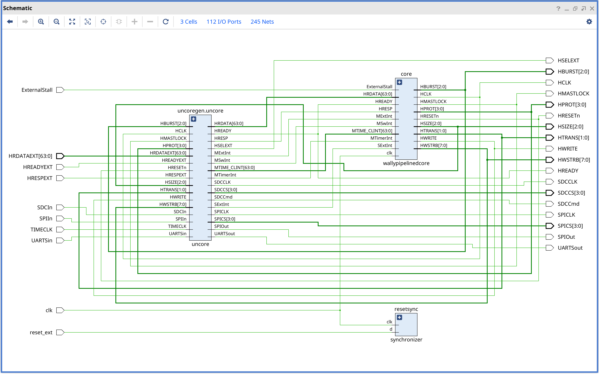
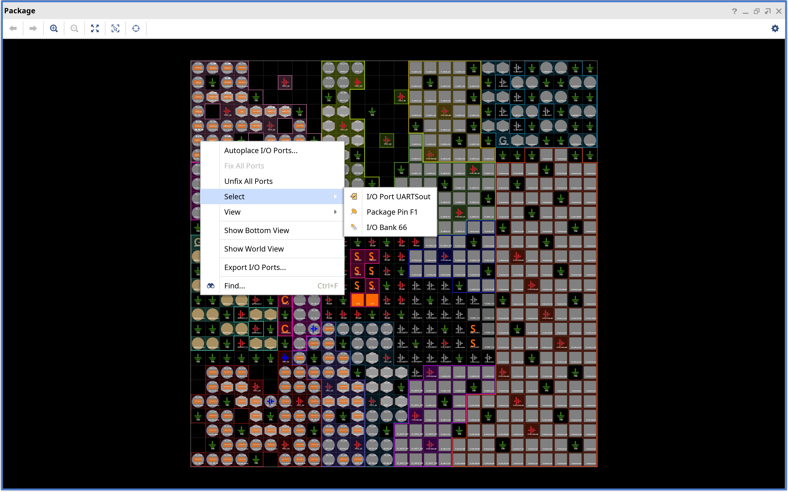
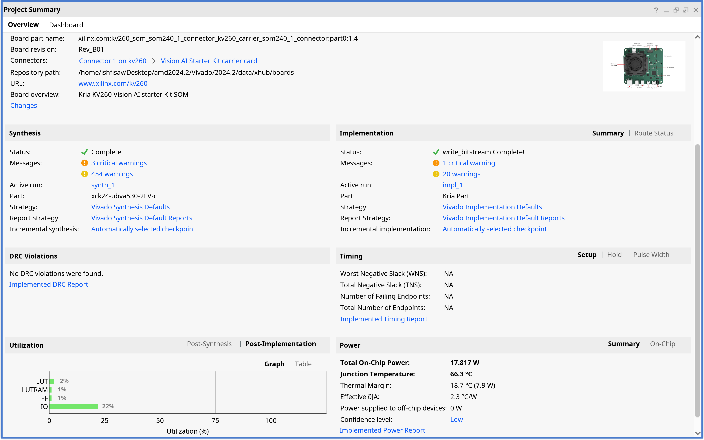

# RISC-V CVW Prototyping on Amd Kria KV260 FPGA

A 64-bit Risc v cpu implementation of 

[https://github.com/openhwgroup/cvw](https://github.com/openhwgroup/cvw)

## Top Image

## IO Image

## Project Summary

