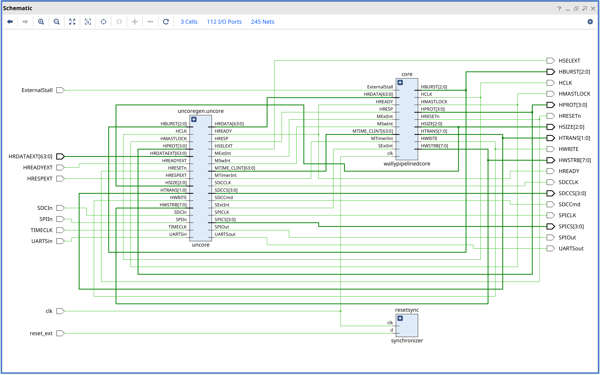
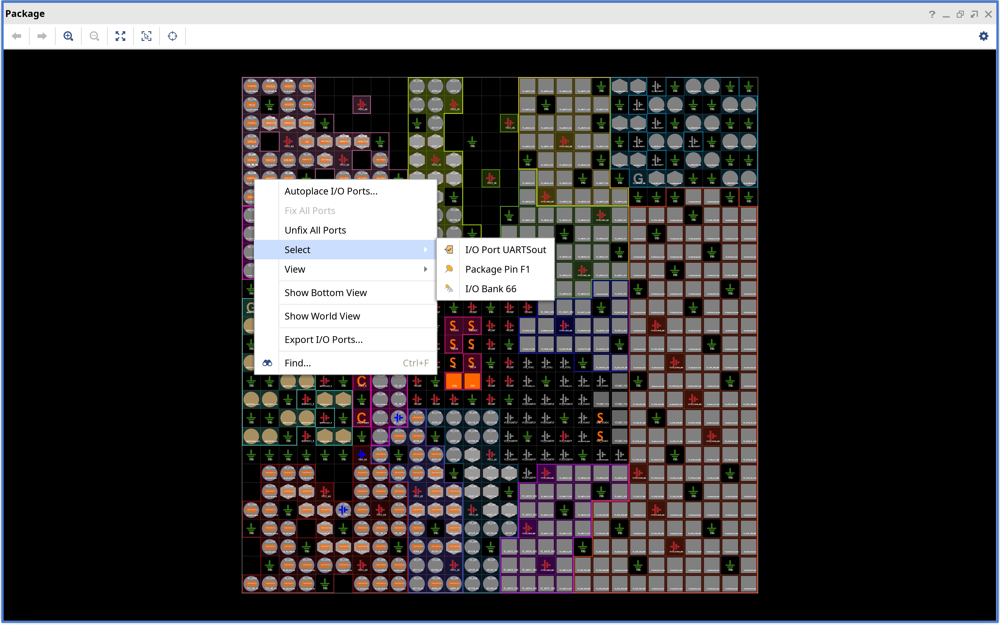
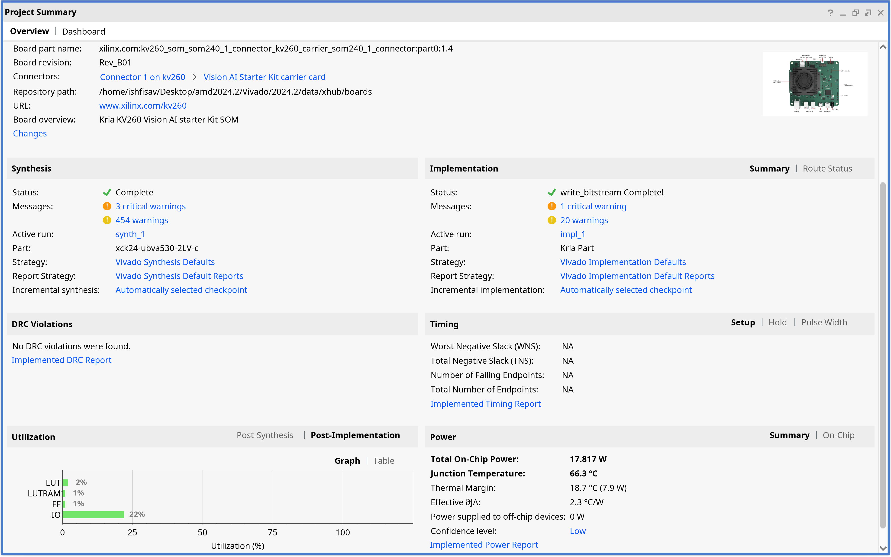

# RISC-V CVW Prototyping on Amd Kria KV260 FPGA

A 64-bit Risc v cpu implementation of [https://github.com/openhwgroup/cvw](https://github.com/openhwgroup/cvw)

## What I did

 * Assigned parameters.
 * Added 2 RAM IPs from Vivado.
 * Disabled FPU features.
 * Fixed all Vivado bugs
 
## What is pending

  * Testing exported hardware with Vitis.

## Top Image

## IO Image

## Project Summary

